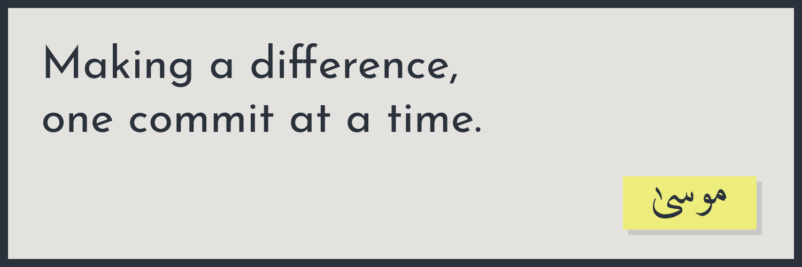

## 

  &nbsp;&nbsp;
  &nbsp;&nbsp;
  &nbsp;&nbsp;
  &nbsp;&nbsp;

### 👋 Hi! I am a ...

**Software Engineer** trying to do good and be good.

### 📚 My latest read ...

**Software Engineering at Google: Lessons Learned from Programming Over Time**. If you are curious about how things are done at Google, do give this book a read! It starts off with an interesting comparison between _programming_ and _software engineering_ and then discusses how the latter is approached at Google.

### 👯 I’m looking to collaborate on ...

**Anything interesting**. Yup! I will be happy to work on interesting projects.

### 🛠️ My tech skills and technologies ...

